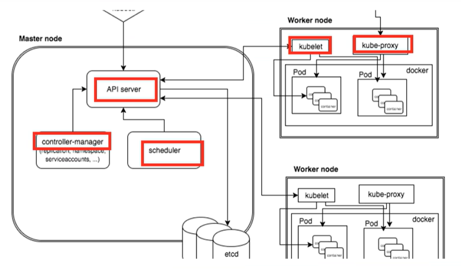
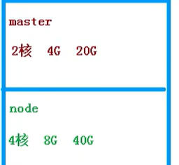

第一部分  k8s概念和架构
第二部分  从零搭建k8s集群
(1)基于客户端工具kubeadm
(2)基于二进制包方式
第三部分  k8s核心概念
 Pod *  Controller  *  Service  Ingress
 RABC  *Helm  *持久存储等
 第四部分  部署统一日志管理
 第五部分  搭建集群监控平台系统，部
 第六部分  从零搭建高可用k8s集群
 第七部分  在k8s集群环境部署项目
-------------------------------
# 第一部分 k8s概念和架构
## 1、k8s概述和特性
k8s是谷歌在2014年开业的容器化集群管理系统
使用k8s进行容器化应用部署
使用k8s利于应用扩展
k8s目标实施让部署容器应用更加简洁和高效
特性
1）自动装箱
   基于容器对应用运行环境的资源配置要求自动部署应用容器
2）自我修复
   当容器失败时，会对容器进行重启
   当所部署的Node节点有问题时，会对容器进行重新部署和重新调度
   当容器未通过监控检查时，会关闭此容器直到容器正常运行时，才会对外提供服务
3）水平扩展
   通过简单的命令、用户UI界面或基于CPU等资源使用的情况，对应用容器进行规模扩大或规模剪裁
4）滚动更新
   可以根据应用的变化，对应用容器运行的应用，进行一次性或批量式更新
5）版本回退
   可以根据应用部署情况下，对应用容器运行的应用，进行历史版本即时回退
6）密钥和配置管理
   在不需要重新构建镜像的情况下，可以部署和更新密钥和应用配置，类似热部署
7）存储编排
   自动实现存储系统挂载及应用，特别对有状态应用实现数据持久化非常重要，存储系统可以来自本地目录，网络存储（NFS,Gluster,Ceph)、公共云存储服务
8）批处理
   提供一次性任务，定时任务；满足批量数据处理和分析的场景
9）服务发现
   用户不需使用额外的服务发现机制，就能够基于Kubernetes自身能力实现服务发现和负载均衡
##  2、k8s架构组件
Master(主控节点)和node(工作节点)
### （1）master组件
* apiserver  集群统一入口，以restful方式，交给etcd存储
* scheduler  节点调度，选择node节点应用部署
* controller-manager  处理集群中常规后台任务，一个资源对应一个控制器
* etcd  存储系统，用于保存集群相关的数据
### （2）node组件
* kubelet   master派到node节点代表，管理本机容器
* kube-proxy  提供网络代理，负载均衡等操作

## 3、k8s核心概念
### 1、Pod 
* 最小的部署单位
* 一组容器的组合
* 共享网络
* 生命周期是短暂的
### 2、Controller
* 确保预期的pod副本数量
* 无状态应用部署
* 有状态应用部署
*  确保所有的node运行同一个pod,一次性任务和定时任务
### 3、Service
* 定义一组pod的访问规则
# 第二部分  从零搭建k8s集群
## 1、搭建k8s环境平台规则
## 2、服务器硬件配置要求
## 3、搭建k8s集群部署方式

# 第二部分从零开始搭建k8s集群

